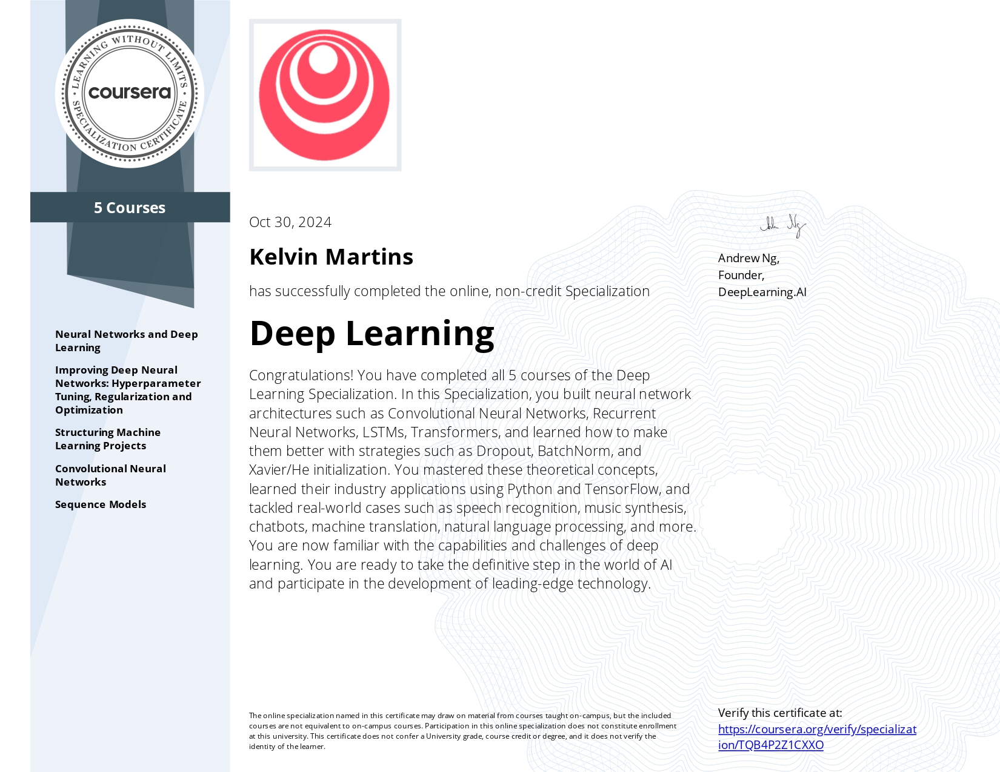

# About this repository

Solved programming assignments from [Coursera Deep Learning specialization](https://www.coursera.org/specializations/deep-learning) offered by [deeplearning.ai](https://www.deeplearning.ai/).

# List of courses

1. [Neural Networks and Deep Learning](./course-01-neural-networks-deep-learning/)

2. [Improving Deep Neural Networks](./course-02-improving-dnn/)

3. Structuring Machine Learning Projects

4. [Convolutional Neural Networks](./course-04-convolutional-neural-networks/)

5. [Sequence Models](./course-05-sequence-models/)

---

